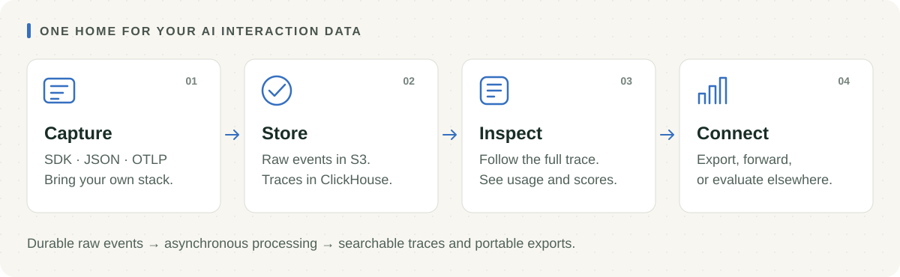

<h1 align="center">Ironside</h1>

<p align="center"><strong>Keep your AI traces. Understand what happened. Take the data anywhere.</strong></p>

<p align="center">
  <a href="https://github.com/luka-zivkovic/ironside/actions/workflows/ci.yml"></a>
  <a href="LICENSE.md"></a>
</p>

<p align="center">
  <a href="#run-it">Run locally</a> · <a href="#install-with-your-coding-agent">Install with an agent</a> · <a href="#mcp-and-agent-harnesses">MCP & harnesses</a> · <a href="#instrument-your-app">SDK</a> · <a href="docs/self-hosting.md">Self-hosting</a>
</p>

Ironside gives your AI traces a home you control. Capture model calls,
inspect the full interaction, and keep the original events available for
later debugging, evaluation, or export. Use the native SDK, JSON, or
OpenTelemetry to connect your application.

<p align="center">
  <picture>
    <source media="(max-width: 600px)" srcset="docs/assets/workflow-mobile.svg">
    
  </picture>
</p>

Ironside focuses on **trace storage, a viewer, and data integrations**. Bring your own evaluation and prompt-management tools. Ironside exposes a native, versioned settled-trace feed for evaluator systems such as [Rubrist](https://github.com/luka-zivkovic/rubrist), while retaining LangFuse-compatible fetch and score APIs for existing tools.

## Where Ironside fits

Ironside is one of a few small, separately installable tools. Each does one
job; none requires the others.

| Tool | Job | Status with Ironside |
| --- | --- | --- |
| **Ironside** (this repo) | Records what your AI did: traces via the SDK, JSON, or OTLP; LangFuse-compatible read and score APIs; a native `ironside/evaluator/v1` settled-trace feed. | Current. |
| [Rubrist](https://github.com/luka-zivkovic/rubrist) | Turns failures into evaluators checked against human judgment. | Current: consumes Ironside's evaluator feed, verified end to end ([`spec/langfuse-fetch-v1.md`](./spec/langfuse-fetch-v1.md), [`spec/evaluator-integration-v1.md`](./spec/evaluator-integration-v1.md)). |
| [Dailies](https://github.com/luka-zivkovic/dailies) | Decides whether an AI change meets release rules from evidence such as Rubrist receipts. | No direct Ironside integration; Dailies consumes Rubrist evidence. |
| [Casefile](https://github.com/luka-zivkovic/casefile) | Inspects agent skills and plugins before installation. | No Ironside integration; it is the scanner used to check this repo's plugin. |
| [Overclock](https://github.com/luka-zivkovic/overclock) | Coding-agent skills, including optional Claude Code and Codex session importers for Ironside. | Current: the importers write to an existing Ironside instance ([session capture](docs/agent-setup.md#capture-coding-agent-sessions)). |

The intent is that traces in Ironside can feed Rubrist, and Rubrist's evidence
can feed Dailies, without any of the three owning the others' data. That is a
direction, not a commitment; see each repository for its own status.

Ironside and Rubrist can also link to each other's views. Set the optional
`IRONSIDE_RUBRIST_URL` on the API to show an **Open in Rubrist** link on each
trace. Rubrist, or any other tool, can link back to a trace at the stable URL
`<Ironside web base>/projects/<projectId>/traces/<traceId>`. Both link
shapes are defined in
[`spec/evaluator-integration-v1.md`](./spec/evaluator-integration-v1.md#viewer-deep-links).

Status: pre-release, under active development. See [ROADMAP.md](./ROADMAP.md). Licensed under the [MIT License](./LICENSE.md).

[Self-hosting](./docs/self-hosting.md) · [SDK guide](./packages/sdk/README.md) · [Roadmap](./ROADMAP.md) · [Security](./SECURITY.md) · [Contributing](./CONTRIBUTING.md)

## Install with your coding agent

In **Claude Code**, add the marketplace and install the plugin, then run
`/ironside:setup`:

```text
/plugin marketplace add luka-zivkovic/ironside
/plugin install ironside@ironside
```

The bundled `setup` skill checks Docker and ports, builds and starts the
Compose stack, verifies health, guides owner setup and project creation, and
helps connect your app with the SDK or OTLP. It keeps credentials out of chat
and Git and asks before anything destructive.

**Codex and other agents** with a shell can do the same from a prompt. Paste
this into a session in your projects directory:

```text
Set up Ironside locally from https://github.com/luka-zivkovic/ironside.
Read its README and docs/agent-setup.md first. Check Docker and available
ports, build and start the Compose stack, and verify service health.
Preserve existing data and services. Guide me through owner setup and
creating a project, then help me connect my app with the SDK or OTLP.
Keep credentials out of chat and Git.
```

**[Agent setup guide →](docs/agent-setup.md)** — Claude Code, Codex, other
harnesses, verification, session capture, and where MCP fits.

## Run it

Requires **Git and Docker with Compose v2**. The containerized installation
builds the application for you; a host Node.js installation is only needed for
[development](#development).

```sh
git clone https://github.com/luka-zivkovic/ironside.git
cd ironside
docker compose up -d --build
```

This starts the full stack — Postgres, ClickHouse, Redis, MinIO, plus the `api`, `worker`, and `web` containers — with migrations and object storage setup handled automatically on boot. Every port is published on `127.0.0.1` only, because the checked-in stack uses development credentials; to run Ironside on a server, use the [self-host bundle](docs/self-hosting.md#generic-single-host-release-bundle). Once `docker compose ps` shows everything healthy, generate the one-time owner setup code:

```sh
docker compose exec api node apps/api/dist/src/scripts/owner-setup.js
```

Open `http://localhost:8080/setup`, paste the code, and create your owner account. The code proves that you control this installation, expires quickly, and works once. Owner access uses an HttpOnly browser session and is separate from machine credentials.

After signing in, create the first project in the UI. Ironside commits the
project and its initial scoped `ironside_sc_...` Ingest credential atomically
and shows the plaintext once. The project's **Connections** page creates
least-privilege Ingest or Integration credentials and provides exact setup
snippets. Copy a token into your SDK/exporter; the browser itself uses only the
owner session and explicit project URLs. See
[`docs/self-hosting.md`](./docs/self-hosting.md) for upgrades, owner recovery,
credential rotation, configuration, and production considerations.

Within a project, environments are automatically observed trace attributes and
an exact, shareable `?environment=...` filter—not access or retention scopes.
The global picker and Configuration page discover/hide retained values; use a
separate project whenever credentials, access, quotas, retention, or isolation
must differ. See [`spec/environments-v1.md`](./spec/environments-v1.md).

## Instrument your app

For third-party frameworks and services, **OTLP/HTTP with OpenTelemetry's `gen_ai.*` semantic conventions is the canonical integration path**. Point the trace exporter at Ironside's signal-specific endpoint:

```sh
export OTEL_EXPORTER_OTLP_TRACES_ENDPOINT=http://localhost:8788/v1/otel/traces
export OTEL_EXPORTER_OTLP_TRACES_PROTOCOL=http/protobuf
export OTEL_EXPORTER_OTLP_TRACES_HEADERS="authorization=Bearer%20${IRONSIDE_API_KEY}"
```

Use the signal-specific `OTEL_EXPORTER_OTLP_TRACES_ENDPOINT`; Ironside's route is `/v1/otel/traces`, not the usual base-endpoint-derived `/v1/traces`. Standard `gen_ai.*` model, usage, operation, and request attributes are mapped into typed Ironside fields, while all attributes are retained in metadata. OTLP has no standard representation for computed cost or eval/human-feedback scores; Ironside derives cost from token usage and the model name at ingest ([`spec/cost-pricing-v1.md`](./spec/cost-pricing-v1.md)), and applications that need scores or an exact provider-billed cost should use the SDK or native JSON ingest alongside it. See [`spec/integration-contract-v1.md`](./spec/integration-contract-v1.md) and [`spec/otlp-ingest-v1.md`](./spec/otlp-ingest-v1.md).

For Node.js applications, the `ironside` package is the ergonomic native integration. Install it with your provider's SDK:

```sh
npm install ironside openai
```

Then wrap the provider client:

```ts
import OpenAI from "openai";
import { init, wrapOpenAI } from "ironside";

const ironside = init({ apiKey: process.env.IRONSIDE_API_KEY, host: "http://localhost:8788" });
const openai = wrapOpenAI(new OpenAI({ apiKey: process.env.OPENAI_API_KEY }), ironside);

// use `openai` exactly as you would the normal OpenAI client — every
// chat.completions.create() call is now automatically traced.
const completion = await openai.chat.completions.create({
  model: "gpt-4o",
  messages: [{ role: "user", content: "hello" }]
});

await ironside.shutdown(); // flush before the process exits
```

`wrapAnthropic` works the same way for `@anthropic-ai/sdk`, capturing model, input/output, token usage, and request sampling parameters (temperature, max_tokens, etc.) automatically. For manual instrumentation, or the Vercel AI SDK, use `init()`'s `trace()`/`span()`/`generation()` directly, or `recordGenerateTextResult()` — see the [`ironside` SDK guide](./packages/sdk/README.md) and runnable [`examples/chatbot`](./examples/chatbot). Every trace/span/generation handle also exposes `score()`, for recording human feedback or eval results directly against a trace.

OTLP is the portable default for third parties; the SDK is the native Node.js convenience layer; and plain JSON `POST /api/v1/ingest` is the low-level escape hatch for the complete wire contract. All three converge on the same durable ingest pipeline (see [`spec/trace-envelope-v1.md`](./spec/trace-envelope-v1.md)). LangFuse/LangSmith compatibility and importers (below) exist specifically for teams **migrating off another platform**, not as the recommended integration path for new instrumentation.

Already storing traces in LangFuse or LangSmith and want them in Ironside too? Point their SDKs at Ironside's compatible endpoints instead of standing up new instrumentation (`spec/langfuse-compat-v1.md`), or backfill your existing history with the pull-based importers (`spec/langfuse-importer-v1.md`, `spec/langsmith-importer-v1.md`) — both capture full observation trees and scores, not just trace summaries.

## MCP and agent harnesses

**Ironside does not currently ship an MCP server.** Its native JSON and OTLP
endpoints are HTTP ingestion APIs; they are not MCP endpoints. A coding agent
can install and instrument Ironside using its shell without an MCP adapter.

To capture coding-agent sessions, Overclock's optional
[eval-stack plugin](https://github.com/luka-zivkovic/overclock/tree/master/plugins/eval-stack)
includes Claude Code and Codex session importers and a pi tracing extension.
See [session capture](docs/agent-setup.md#capture-coding-agent-sessions) for the
separate installation path.

For evaluation tools inside your harness, [Rubrist](https://github.com/luka-zivkovic/rubrist)
can consume Ironside's native evaluator feed and exposes its own
[stdio MCP server](https://github.com/luka-zivkovic/rubrist/tree/main/tools/mcp).
That connection uses a **Rubrist project key**. Ironside's **Integration**
credential is configured separately in Rubrist to read traces and write scores.

## Architecture

| Layer | Responsibility |
| --- | --- |
| API · Hono | Accept events, persist raw data, and expose project APIs. |
| Object storage · MinIO/S3 | Retain the immutable raw event log. |
| Queue · Redis/BullMQ | Coordinate asynchronous processing. |
| Worker + ClickHouse | Build searchable trace, observation, and score projections. |
| Web · React | Browse traces, manage projects, and configure connections. |
| Postgres | Store organizations, projects, credentials, and configuration. |
| Export workers | Write Parquet, forward OTLP, and deliver webhooks. |

The [ingest contract](spec/trace-envelope-v1.md) and
[self-hosting guide](docs/self-hosting.md) cover durability and operation in detail.

## Development

Requires Node ≥24, pnpm 10, Docker. This runs the apps on the host (fast rebuild/reload) against Dockerized infra only — for running the full containerized stack instead, see "Run it" above.

```sh
pnpm install
docker compose up -d postgres clickhouse redis minio
pnpm build && pnpm test
pnpm --filter @ironside/api dev     # in one terminal
pnpm --filter @ironside/worker dev  # in another
pnpm --filter @ironside/web dev     # in a third — http://localhost:5174
```
